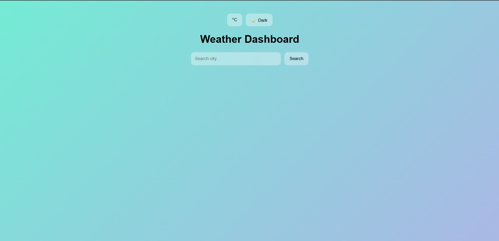
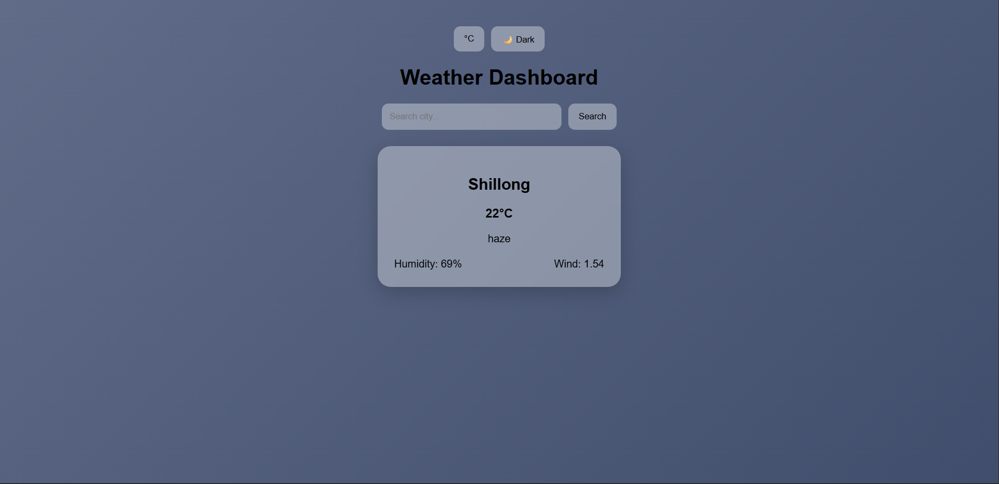
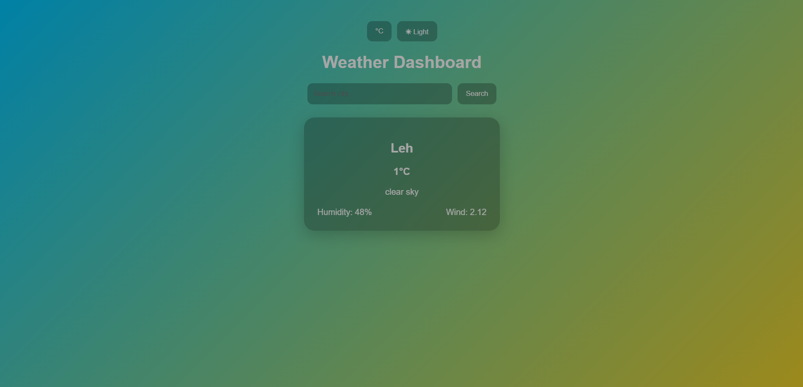

# Dynamic Weather Dashboard

A responsive weather dashboard made using React and Open weather API.

This project shows live weather details of searched city with background changes according to weather condition. It also includes dark/light mode and temperature unit toggle for better user experience.

---

## Features

- Search weather by city name
- Background changes based on weather
- Dark / Light mode toggle
- Celsius / Fahrenheit toggle
- Loading indicator while fetching data
- Error handling for invalid city names
- Responsive glassmorphism UI design

---

## Screenshots

### Home UI


### Rain Weather Theme


### Dark Mode


---

## Tech Stack

- React JS
- CSS3
- OpenWeather API

---

## How to Run Locally

1. Clone the repository

```bash
git clone <your-repo-url>
```

2. Install dependencies

```bash
npm install
```

3. Create `.env` file in root directory

```env
REACT_APP_WEATHER_API_KEY=your_api_key_here
```

4. Start development server

```bash
npm start
```

---

## Future Improvements

- 5 Day Forecast Feature
- Weather Icons and Animations
- Recent Search History
- Better Mobile Optimization

---

## Author

Made by Ketan Dora ;)